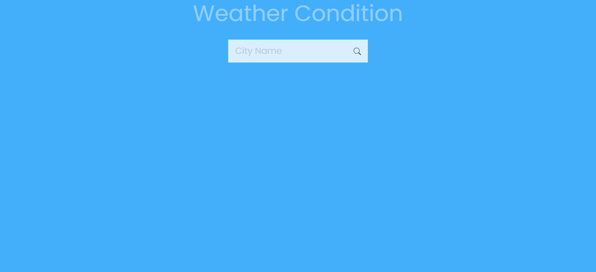
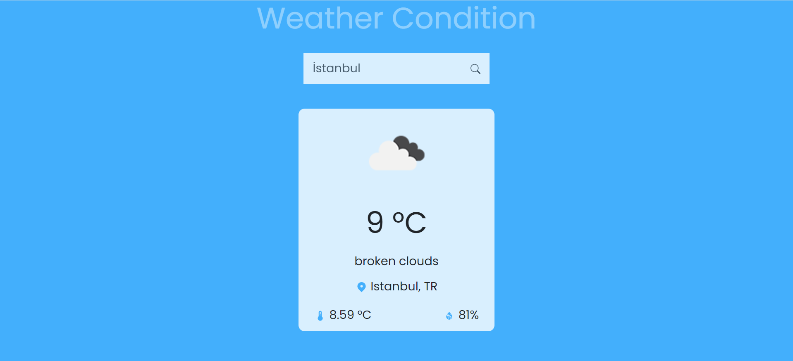

# Vatansoft Weather App

## Description

here is a project by working API in it and showing current popular movies on  UI.  

## Features

- React
- Bootstrap
- React-router-dom
- Using Movie DB Api and fetch data by axios.
- React Formik
- Using React Hook Form for Validation.

## Kurulum
- git clone https://github.com/bilalgokburi/vatansoft-weather-app 
1. npm update 
2. npm start
 
 or

1. docker build -t weather-app .
2. docker run -p 8080:8080 weather-app

## Project Screen Shot(s)

